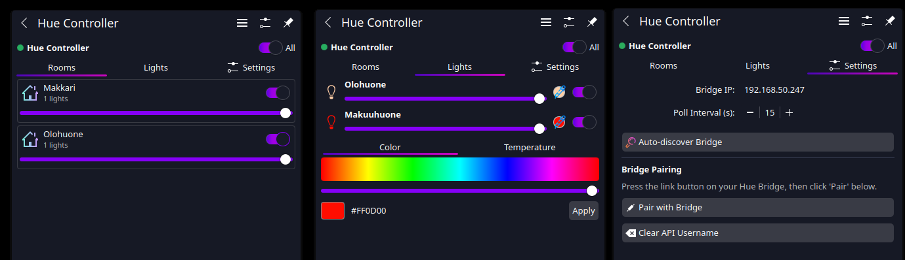

# Hue Controller for KDE Plasma 6

> A KDE Plasma 6 Plasmoid for controlling Philips Hue lights via the local Bridge API. 




## Features

- **System Tray Integration** — Status & Notifications entry with connection status
- **Tabbed Popup** — Rooms, Lights, and Settings views
- **Light & Room Controls** — Toggle, brightness, color and temperature
- **Bridge Discovery** — Auto-discovery or manual IP entry
- **Local API Pairing** — Generates a bridge username stored in Plasmoid config

## Quick Start

### Installation

```bash
# Install the Plasmoid
kpackagetool6 --type Plasma/Applet --install .

# Or upgrade an existing installation
kpackagetool6 --type Plasma/Applet --upgrade .
```

### First-Time Setup

1. Enable "Hue Controller" in **System Tray** settings (Status & Notifications)
2. Open the System Tray dropdown and click the Hue Controller icon
3. Go to **Settings** tab
4. Enter your Hue Bridge IP address or use Auto-discover
5. Press the **link button** on your Hue Bridge
6. Click **Pair with Bridge** within 30 seconds
7. Done! Your lights should now appear

## Configuration

### Bridge Setup

| Setting | Description |
|---------|-------------|
| Bridge IP | Local IP address of your Hue Bridge (e.g., `192.168.1.100`) |
| Poll Interval | How often to refresh light states (default: 15 seconds) |

## Troubleshooting

| Problem | Solution |
|---------|----------|
| "Cannot reach bridge" | Check the IP address and ensure Plasma can reach it |
| "Authentication expired" | Re-pair with the bridge via Settings |
| Lights not responding | Verify bridge is online and lights are reachable |
| Widget not appearing | Restart Plasma: `plasmashell --replace &` |

## Requirements

- KDE Plasma 6
- Qt 6
- Philips Hue Bridge with local API access (CLIP v1)

## License

MIT
